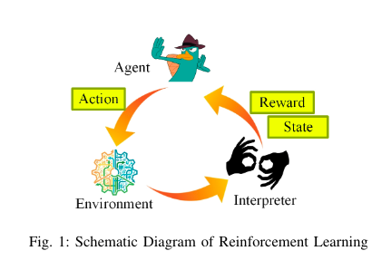

## 摘要

作为一种有前途的机器学习工具，用于处理复杂原始数据的精确模式识别，深度学习（DL）正成为向大规模拓扑和复杂无线电传输的无线网络添加智能的有效方法。
DL使用许多神经网络层来实现从高维原始数据中快速提取特征。 它可以用于根据大量网络参数（如延迟，丢失率，链路SNR等）的分析来查找网络动态（如
热点，干扰分布，拥塞点，流量瓶颈，频谱可用性等）。 因此，DL可以分析具有多个节点和动态链路质量的极其复杂的无线网络。本文对不同网络层的DL算
法应用进行了全面的调查，包括物理层调制/编码，数据链路层访问控制/资源分配和路由层路径。 本文还讨论了利用DL增强其他网络功能，如网络安全，传感数据
压缩等。此外，还详细讨论了该领域尚未解决的研究难题，代表了未来的研究趋势。 基于DL的无线网络。 本文可以帮助读者深入理解基于DL的无线网络设计的最
新技术，并选择有趣的未解决的问题来研究他们的研究.

关键词： 无线网络，深度学习(DL)，深度信息学习(DRL)，协议层，性能优化

## 引言

人脑具有强大的数据处理能力。我们每天都要面对来自外部世界的大量数据。在复杂的环境下，我们的感官首先会收集大量的物体特征。然后大脑从这些特征数据中
提取抽象的特征，最后做出决定。在许多领域，计算机已经显示出与人类相当甚至更强大的能力，如玩游戏，自动控制，语音和图像识别等。计算机实现这些能力的
方法与人类非常相似。该训练过程允许计算机确定能够提取的神经节点之间的适当输入数据的特性。一旦神经网络经过训练，就可以做出适当的决定以获得高回报。 
这个想法在许多现实世界的控制场景中都取得了巨大的成功，例如语音识别[2]，[3]，图像识别[4]，[5]，[6]，[7]，语义分析[8]，[ 9]，语言解释[10]，[11]，
游戏控制[12]，药物发现[13]，生物医学科学[14]，[15]，[16]等。

DL是机器学习的子类，它使用级联层从输入数据中提取特征并最终形成决策。 DL的应用应考虑四个方面：
1. 如何将环境以数值格式作为DL网络的输入层; 
2. 如何表示/解释认知结果，即DL网络的输出层的物理意义; 
3. 如何计算/更新权值，以及在每个神经层中引导迭代权重更新的适当奖励函数是什么;
4. DL系统的结构，包括隐藏层的数量，每层的结构以及层之间的连接。

目前，许多DL系统与增强学习（RL）模型[17]相关联，其包括三个部分：
1. 可以通过某些特征描述的环境
2. 采取行动改变环境的代理
3. 解释器，它表示当前状态和代理所采取的行动产生的奖励

同时，解释器在环境中行动生效后公布奖励，如（图1）所示.RL的目标是培训代理人，以便对于给定的环境状态，它选择产生最高回报的最佳行动。 。 因此，DL和RL之间
的主要区别之一是前者从示例（例如，训练数据）中学习以创建模型以对数据进行分类，然而，后者通过最大化与不同动作相关联的奖励来训练模型。

DL已经显示出惊人的处理许多现实场景的能力，比如AlphaGo的成功、手机上的人脸识别等等。计算机网络领域的研究人员也对深度学习应用产生了浓厚的兴趣。利用DL模
型可以表示复杂的网络环境，得到抽象的特征，最终为计算机网络节点实现更好的决策，从而实现网络服务质量(QoS)和体验质量(QoE)的改进。

无线网络具有复杂的特性，如通信信号特性、信道质量、各节点排队状态、路径拥塞情况等。另一方面，许多网络控制目标对通信性能有重要影响，如资源分配、队列管理、
拥塞控制等。为了处理复杂的情况，机器学习技术已经得到了广泛的探索。Chen等人对ML在无线网络中的应用进行了全面的总结，包括无人机无线通信和组网、无线虚拟现实、
移动边缘缓存和计算、频谱管理以及多无线接入共存、物联网等[19]。与传统方法相比，ML在这些领域的应用呈现出惊人的进步。

另一方面，由于现代无线网络变得越来越复杂，学习训练系统带来了越来越多的要求，如更高的计算能力，更大的数据集，更快更智能的学习算法，更灵活的输入机制[19]等。 
显而易见，无线网络中的深度学习应用已经吸引了大量的兴趣。 DL为无线网络配备了“人脑”：它接受大量的网络性能参数，例如链路信噪比（SNR），信道保持时间，链路接
入成功/冲突率，路由延迟，丢包率 ，比特错误率等，并对内在模式（例如拥挤度，干扰对准效应，热点分布等）进行深度分析。这些模式可用于在不同的协议层中执行协议控制。 
例如，路由层可以开始寻找新的备用路径; 传输层可以缩小拥塞窗口大小，等等。与传统的机器学习技术相比，DL在无线网络应用方面提供了更有前景的改进：
1. 更高的预测准确性。 无线网络具有高度复杂的特征，例如节点的移动性，信道变化，信道干扰等。由于深层神经层的缺失，机器学习方法无法深入分析这些特征。 然而，输入
参数中隐藏的深度图案可以通过深度学习算法逐层抽象，从而提供更高的预测精度。
2. 无需预处理输入数据。 ML的预测精度很大程度上取决于数据预处理。 然而，DL的输入通常是直接从网络收集的特征参数。考虑到无线网络参数的显着多样性，DL的这种优点降
低了设计复杂度并提高了预测精度。

应用DL进行无线网络的成功归功于DL和人脑之间的以下三个相似之处：
1. 容忍不完整甚至错误的输入原始数据：人类大脑可以容忍扭曲的样本。 例如，我们仍然可以识别出有部分图像形状缺失的'1'的图像，并且我们可以从一个模糊的面部图像识别人物，
即使某些像素正在丢失。 同样，DL使用深度神经网络来容忍输入数据或扭曲输入数据。 这种能力对于无线网络很重要，因为由于信道衰弱，节点移动性和控制信道故障，不可能准确地
收集所有无线电链路的状态。
2. 处理大量输入信息的能力：人脑可以同时吸收多种类型的复杂信息并做出良好的判断。 例如，我们可以使用声音，图像和气味来检测狗的情况。 同样，DL可以同时接受来自多个协议
层的大量性能数据（例如1000个节点的排队状态数据和链路干扰矩阵），然后确定大型网络中的具体拥塞。 DL将在bigdata无线传输中发挥关键作用，因为它能够分析巨大流量的性能参数。
3. 做出控制决策的能力：我们的大脑会学习和指导我们的行为。 被动学习可能不是网络分析的最终目标。 使用学习结果来指导正确的网络控制是最终目标。利用马尔可夫决策模型，DL能
够发展入侵强化学习（DRL）模型，该模型可以使用系统状态，奖励功能和政策寻求的更新来制作 基于最大向前计算的合适网络控制。 因此我们可以使用DRL来实现大规模的无线网络控制。

在本文中，提出了针对无线网络中DL应用的全面调查。 图2显示了我们在审查每个网络方面的各种用途时使用的分类法。 我们在本次审核中的贡献包括3个重要方面：

1. 不同层次的DL应用：我们将系统地分析采用DL/DRL进行不同层次网络特征提取的好处。 如图2所示，物理层，DL可用于干扰对准。 它还可以用于对调制模式，设计有效的纠错码等进行
分类。在数据链路层中，DL可以用于资源（例如信道）分配，链路质量评估等。 在网络（路由）层中，它可以帮助寻找最佳路由路径。 在更高层（例如应用层）中，它用于增强数据压缩和
多会话调度。 我们将为每个DL应用程序提供核心设计，并比较不同的解决方案。
2. DL在安全性和其他网络功能方面的优势：除了上述协议栈之外，我们还将讨论在其他网络功能中使用DL的优势。 一个评判标准是安全和隐私保护。 今天，由于网络规模的增加和通过攻击
检测器/过滤器的大量流量，入侵检测变得更具挑战性。DL是执行大规模的检测潜入侵事件和网络配置文件分析理想工具。我们将解释DL如何用于将数据包分类为良性/恶意类型，以及如何将
其与其他机器学习方案（如无监督聚类）集成，以实现更好的异常检测效果。
3. 未来趋势：由于该领域尚未成熟，许多问题尚未解决，我们将介绍使用DL增强一些流行无线网络的10个挑战性问题，如认知无线电网络（CRN），软件定义网络（ SDN），露水/雾计算等。
我们将为这10个问题中的每一个提供背景，动机，问题陈述和具体未解决的问题。 它们对寻求新研究方向的读者很有帮助。

本文的其余部分安排如下：在第二部分，为准备讨论无线网络功能的DL应用，我们首先解释DL的基本数学模型，包括它与一般机器学习和基于图形的关系，学习框架。然后，我们将在第三节中讨
论基于DL的物理层增强在信号干扰和调制分类方面的问题。 第四节讨论了DL在数据链路层设计中的重要性。一些典型的MAC设计示例用基于DL的增强来解释。在第V节中，描述了基于DL的路由层
操作，例如路径建立和优化。 第六部分讨论了DL用于安全性和其他网络功能的用途。第七节总结了在无线网络研究中广泛使用的一些DL实现平台。 接下来要解决的十个具有挑战性的研究问题在
第八节中说明，然后是第九节中的结合标记。

## 深度学习的基础

DL源自机器学习（ML）。 在本节中，我们首先分析两种技术之间的差异和关系。 然后，简要介绍了DL原则。

#### 从机器学习到深度学习

ML和DL都解决了神经网络的现实问题。 典型的ML系统由三部分组成：
- 输入层，将预处理数据作为系统输入。 真实世界数据的特征（例如，像素值，形状，纹理等）需要由人预处理和识别，以便ML系统可以处理它们。
- 特征提取与处理层，其中数据处理的单层用于提取数据模式。目前，支持向量机(SVM)、主成分分析(PCA)、隐马尔可夫模型(HMM)等方法被广泛用于特征提取。
- 输出层，根据ML模型的任务，分析分类，回归，聚类，密度估计或降维的结果。 ML的示意结构如图3（a）所示。

输入到学习系统的原始数据可以是多种多样的，从图像，音频和视频等自然信息到各种定量事件描述。虽然学习系统的输入可能不同，但核心数据学习模块需要输入数据具有无形的形式，输入事件
根据该形式进行分类。因此，为了使学习过程能够“识别”输入数据，需要对原始自然数据进行预处理，即原始数据需要转换成适当的表示或特征向量，这可以被ML分类系统接受。数据预处理需要精心
设计，以保持与分类相关的原始自然数据的特征。 分类精度受数据预处理方案的显著影响。

机器学习系统通常在输入和输出层之间只有一个隐藏层。 这种类型的学习系统也被称为浅层学习网络，它提供任意函数逼近器，在一个隐藏层中具有足够的隐藏单元，并从输入层学习或多或少的独立
特征。 例如，Chen等人提出了一种基于浅层学习网络的无线电地图学习系统，该系统利用机器学习方法开发无人机辅助无线网络的分段模型和信号强度模型，并重建精细结构的无线电地图，以提高
服务覆盖范围[20]。

相反，大多数深度学习系统在输入和输出层之间有一个隐藏层，其中上层的输入是其下层的输出，例如[21]，[22]，[22]中提出的学习网络。 [23]，[24]。 DL技术通过在输入层和输出层之间使用
多个隐藏层来避免复杂的输入数据处理，如图3（b）所示。 然后将自然数据以其原型输入到学习系统中。 然后，DL系统自动提取适当的表示以用于分类或检测目的。 从自然数据开始，每个层从输入
数据中提取不同的特征，逐渐放大与决策制定更相关的特征并抑制不相关的特征。 每层连接到相邻层，不同的权重连接到连接。 为了确定权重的值，将大量样本发送到系统用于训练目的，这可以是
监督学习或无监督学习。 在监督学习中，计算每个权重的梯度向量，指示误差随着权重的变化而变化。根据梯度向量，调整权重以减少误差。

#### 深度学习框架

人类通过结合强化学习和高级分层感觉处理系统自发地与环境相互作用，实现诸如物体识别[25]，条件反射和选择[26]等许多任务。受动物行为的启发，提出深度强化学习，并引起了计算机智能的关注。
DL模型包括两个关键因素：前向特征抽象和后向错误反馈。训练过程通常需要两个要素，而验证过程只能实现前者。

## 深入学习物理层设计

DL在无线网络的物理层（PL）中起重要作用。 例如，DL可以帮助确定最合适的调制/编码方案，根据复杂无线电条件的综合分析，包括频谱可用性，干扰分布，节点移动性，应用类型等。在下面的讨论中，
我们将提供一些典型的DL应用 用于PL函数控制。

例如：
1. 干扰对齐
2. 抗干扰
3. 调制分类
4. 物理编码

#### 浅谈DL在物理层中的应用

在无线网络中，干扰对齐和抗干扰是两个最棘手的问题，考虑到节点数量大，节点的移动性，信道条件的变化，复杂的频率使用等等.DL是处理复杂问题的理想工具， 因为它从混合和巨大的物理层参数中
抽象出内在模式。 另外，调制和纠错编码是物理层的基本功能，这往往需要在现代网络中进行大量计算，例如正交频分复用（OFDM）调制，网格编码调制（TCM），Turbo码，LDPC码， 通过DL技术可以
显着改善这些操作的性能。 然而，大多数物理层问题对反应时间有严格的限制，因此，DL服务器的使用和计算复杂度控制是物理层中DL应用的关键问题。

## 数据链接层的DL

1. DL用于频谱分配
2. DL用于流量预测
3. DL用于链接评估

#### 浅谈DL在数据链路层中的应用

DL在数据链路层中的应用主要集中在资源分配，流量预测和链路评估问题上，产生了有希望的性能改进，如表IV所示。 考虑到现代网络的大尺寸，DL系统通常需要读取巨大的DLL参数来做出决定。 
因此，如何限制计算和数据大小是DLL中的学习应用的巨大挑战。 同时，准确估计信道条件对于深度学习系统做出准确的DLL决策至关重要，这对于快速信道变化和决策制定过程的时间限制是一个挑战。

## 路由层

为无线网络开发的现代路由协议基本上分为四种类型：
- 基于路由表的主动协议
- 按需反应协议
- 地理协议
- 基于ML/DL的路由协议。

基于DL的路由协议由于其对复杂网络的优越性能而在过去几年中得到了广泛的研究。

1. 基于RL的生命周期感知路由
2. DL用于路由路径搜索
3. DL用于其他路由性能优化

#### 浅谈DL在路由层中的应用

对于基于DL的路由方案，集中路由与分布式路由是一个棘手的选择。 这是因为深度学习过程需要巨大的参数作为输入来做出决定以及对神经网络进行大量计算。

如果采用集中式路由策略，则应仔细解决三个主要问题。 
- 首先，必须将大量的网络环境数据（例如节点的能量状况，队列大小，信号强度等）发送到中央控制器。 在这种情况下，由环境数据产生的传输负载是巨大的，并且过多的开销降低了网络的良好吞吐量。
- 其次，需要在有限的时间内建立路由拓扑。 然而，当传输到中央控制器时，信道环境数据可能被延迟，从而导致路由形成的延迟。 
- 第三，灵活性较低，即中心节点运行DL算法并不总是可用。 例如，[74]中提出的路由方法采用集中式DL策略，其在基站中训练DL模型并由此对节点的连接级别进行分类。 然而，对于某些自组织网络，很难找到具有巨大计算能力的中央服务器以及适当的地理位置。

另一方面，如果使用分布式路由策略，则每个节点（或每个源节点）必须训练几个DL模型。 因此，每个节点都需要巨大的计算能力和存储空间。 例如，分布式DL策略已被QELAR [69]和Kato的方案[71]采用，
其中源节点触发DL过程并使用训练模型生成路由拓扑。

