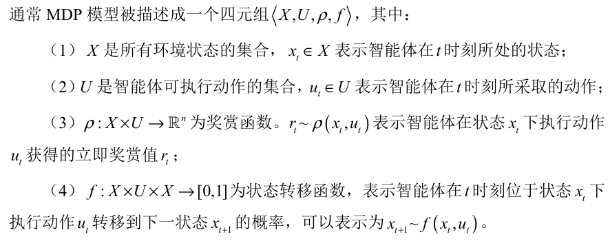

# 深度Q网络算法与模型研究

## 引言

1. 深度学习：通过堆叠多层网络结构和非线性变换，组合低层特征以实现对输入数据的分级表达
2. 强化学习：智能体通过试错机制与环境进行交互，以最大化从环境中获得的累计奖赏

### 深度强化学习工作机制

1. 每个时刻，智能体从环境中得到一个高维度的观察，并利用深度学习方法来感知观察，以得到抽象、低维度的状态特征表示
2. 基于智能体与环境交互的代的奖赏信号来评价各个动作的价值函数，并通过某种策略将当前状态映射为相应的动作
3. 环境对当前动作做出反应，以得到下一个观察。
4. 循环以上过程，最终智能体可获得最大累计回报

### 马尔科夫决策过程

若一个强化学习问题满足马尔科夫性质，则可以将该问题称为一个马尔科夫决策过程(MDP)。

### 强化学习

- 基于模型的强化学习算法
    - 事先构造奖赏函数和状态转移函数
    - 利用贝尔曼方程迭代求解最优状态值函数或者最优状态动作值函数
    
- 模型无关的强化学习算法
    - 不依赖环境动态模型，与环境不断交互获取训练样本
    - 根据样本数据学习有效策略
    - 相关算法（蒙塔卡罗、时间差分）
    
- 策略梯度方法
    - 直接优化策略，在策略空间中通过优化过程搜索最优策略
    
### 蒙特卡罗方法

以部分估计整体，并通过统计模型或者抽样获得问题近似解

由于MC基于完全抽样机制，只有当智能体所处的状态到达终止状态时，估计的值函数和对应的策略才会发生改变。因此MC方法适用于存在终止状态的

### Q学习算法

一种经典的模型无关的强化学习算法。该算法迭代时采用的是状态动作对的奖赏和值函数O（x,u）,而非状态值函数V（x）。由于行为策略和评估策略不一致，因此
Q学习属于一种离策略的强化学习方法。

### 行动者评论家算法

结合使用值函数和策略梯度方法，是一种利用独立存储结构直接表示策略TD方法。其中,行动者部分根据学习到的值函数动态地更新策略
参数;评论家部分则用来估计当前状态(动作)的值函数,并评价行动者的当前策略。

### 深度Q网络  

深度 Q 网络算法属于深度强化学习领域中的开创性工作,有着极大的研究和应用价值。该算法结合使用卷积神经网络和 Q 学习算法,并通过几处改进一定程度上
解决了用非线性的神经网络逼近器近似表示值函数时算法不收敛的问题。

### 深度Q学习

深度 Q 网络的训练算法通常被称为深度 Q 学习,该算法主要在传统的 Q 学习算法的基础上做了三处改进。

- 使用经验回放机制
- 固定目标 Q 值网络
- 缩小奖赏值范围

## 深度Q网络  

优点：

- 端到端学习
- 直接使用视频原画作为输入
- 在解决视频游戏任务时表现出与人类相媲美的水平

缺点：

- 面临奖赏的稀疏和延迟
- 部分状态可观察
- 收敛速度慢
- 性能不稳定
- ...等问题

## 深度Q网络改善方法

1. 基于优先级采样深度Q学习算法（解决深度Q网络训练算法不能区分不同转移序列之间重要性差异的问题）
2. 基于视觉注意力机制的深度循环Q网络模型（解决Q网络算法不擅长解决战略性决策任务的问题）
3. 基于混合目标Q值的深度确定性策略梯度方法（解决深度确定策略梯度算法在解决连续动作空间问题时性能不稳定的问题）

### 基于优先级采样深度Q学习算法(Deep Q-Learning with Prioritized Sampling, PS-DQN)

使用基于优先级的经验回放机制替代随机采样（提高有价值转移样本的利用率，并保证样本空间中每个转移序列都有一定大小的采样概率，从而提升算法收敛速度）

该算法将一种高效的优先级采样机制和深度 Q 学习算法相结合,一定程度上缓解了传统深度 Q 学习中有价值样本利用率不高的问题,提高了智能体在面对一些基于视觉感知的决策
问题时的性能和稳定性。

创新点：

1. 使用一种基于优先级采样的经验回放机制来消除样本之间的相关性。该机制根据奖赏项的不同量级,将转移样本 ( xt, ut, rt, vt, xt+1) 存储到不同的回放记忆单
元中。在训练的每个时刻,智能体通过优先级采样从回放记忆单元中抽取固定大小的批次转移样本,并基于这些样本通过随机梯度下降法来更新网络模型的权重。
2. 使用独立的目标值网络来产生目标Q值， 目标值网络的权重通过缓慢追踪当前值网络的权重来更新

缺点：

1. PS-DQN 算法不能解决一类难度较大的战略性挑战任务;
2. PS-DQN 只适用于离散动作空间下大规模的决策问题,无法将其应用场景扩展到更加普遍的连续动作空间。

### 基于视觉注意力机制的深度循环Q网络模型

基于视觉注意力机制的深度循环Q网络模型架构主要在原有的 DQN 基础上做了两方面的改进:

1. 引入由双层 GRU 构成的 RNN 来记忆时间轴上的序列状态信息,一定程度上缓解了智能体在解决战略性任务时存在的部分有价值状态不可观测的问题
2. 通过在模型中引入 VAM,智能体能够在训练过程中自适应地将注意力集中于当前画面中对学习更具价值的部分区域,以促进智能体更加直观、快速地做出正确的决策。实

#### 门限循环单元

- 循环神经网络：
循环神经网络(Recurrent Neural Network ,RNN)是一种对时间维度上的序列数据进行显示建模的深度学习模型。 RNN 通过添加跨越时间步的自连接隐藏层,使
得网络中的处理单元之间既有前馈连接又有内部的反馈连接。这种连接方式使模型具备了记忆动态时序信息的能力。
- GRU：
GRU 相比较于 LSTM 有一个显著的优点:GRU 可训练的权重数目更少,所以不容易出现过拟合的问题。 GRU 通过不同功能门结构的组合开关,不断传播有价值
的数据流,并过滤掉冗余数据,从而使得模型输出更加抽象、紧凑的多时间步长内的时序状态信息。

### 基于混合目标Q值的深度确定性策略梯度方法

结合在策略MC估计和离策略的Q学习方法生成混合型的目标Q值（降低目标Q值的评估误差，提升算法在连续动作空间问题中的型性能和稳定性）

#### 策略梯度方法

与基于值函数的强化学习方法不同,基于策略梯度的方法直接在参数化的策略空间中搜索解决问题的最优策略,并且严格保证每一步的更新都能提高当前策略的性能。

