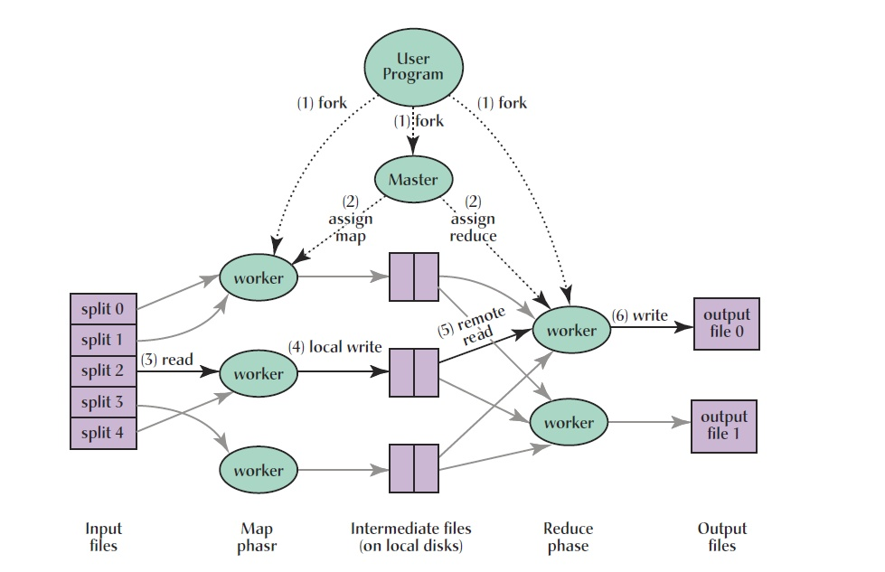

MapReduce算法
===========

MapReduce算法背景
----------------

```
因为数据太大而让仅仅一台机器难以有效存储或分析的问题。
MapReduce通过把计算量分配给不同的计算机群，能够解决大部分和大数据有关的分析问题。
Hadoop提供了最受欢迎的利用MapReduce算法来管理大数据的开源方式。
```

拆分MapReduce算法
-----------------

```
MapReduce合并了两种经典函数：

1、映射（Mapping）对集合里的每个目标应用同一个操作。即，如果你想把表单里每个单元格乘以二，那么把这个函数单独地应用在每个单元格上的操作就属于mapping。
2、化简（Reducing ）遍历集合中的元素来返回一个综合的结果。即，输出表单里一列数字的和这个任务属于reducing。
```

经典图
---------


MapReduce模式
-----------

```
MapReduce致力于解决大规模数据处理的问题，因此在设计之初就考虑了数据的局部性原理，利用局部性原理将整个问题分而治之。MapReduce集群由普通PC机构成，为无共享式架构。在处理之前，将数据集分布至各个节点。处理时，每个节点就近读取本地存储的数据处理（map），将处理后的数据进行合并（combine）、排序（shuffle and sort）后再分发（至reduce节点），避免了大量数据的传输，提高了处理效率。无共享式架构的另一个好处是配合复制（replication）策略，集群可以具有良好的容错性，一部分节点的down机对集群的正常工作不会造成影响。
```
