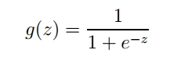
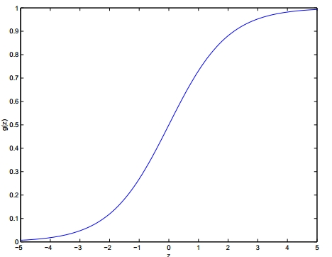
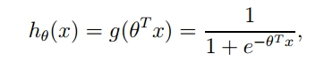
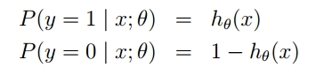
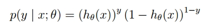
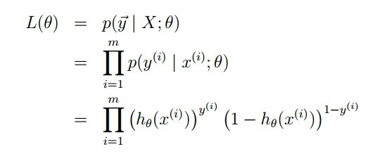
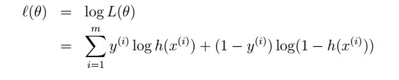

### 机器学习算法
##### 1. 线性模型
1）LR 的推导

Logistic本质上是一个基于条件概率的判别模型(DiscriminativeModel)。

图像为:

通过sigma函数计算出最终结果，以0.5为分界线，最终结果大于0.5则属于正类(类别值为1)，反之属于负类(类别值为0)。

如果将上面的函数扩展到多维空间，并且加上参数，则函数变成：

如何得到合适的参数向量θ呢?

由于sigma函数的特性，我们可作出如下的假设：

上式即为在已知样本X和参数θ的情况下，样本X属性正类(y=1)和负类(y=0)的条件概率。

 

将两个公式合并成一个，如下：

既然概率出来了，那么**最大似然估计**也该出场了。假定样本与样本之间相互独立，那么整个样本集生成的概率即为所有样本生成概率的乘积：

为了简化问题，我们对整个表达式求对数，(将指数问题对数化是处理数学问题常见的方法)：

满足似然函数(θ)的最大的θ值即是我们需要求解的模型。

- 目标函数：似然损失
- 优化方法：
    - 梯度下降
    - 牛顿法：牛顿法在求解逻辑回归时比梯度下降法收敛速度快
- LR 为什么用 sigmoid 函数？这个函数有什么优点和缺点？为什么不用其他函数？[参考这里](https://ask.julyedu.com/question/85100)
- LR 防止过拟合
    - 避免模型的过拟合，需要加上正则项
    
2）模型对比

- LR 定义？线性回归可以用来做正负分类么？
- LR 和 SVM 区别？
    - 本质上其loss function不同
    - 支持向量机只考虑局部的边界线附近的点，而逻辑回归考虑全局（远离的点对边界线的确定也起作用）
    - 在解决非线性问题时，支持向量机采用核函数的机制，而LR通常不采用核函数的方法
    - ​线性SVM依赖数据表达的距离测度，所以需要对数据先做normalization，LR不受其影响
    - SVM的损失函数就自带正则！！！（损失函数中的1/2||w||^2项），这就是为什么SVM是结构风险最小化算法的原因！！！而LR必须另外在损失函数上添加正则项！！！
    
- LR 和最大熵模型的关系？
	- 最大熵模型(maximum entropy model， MaxEnt)也是很典型的分类算法了，它和逻辑回归类似，都是属于对数线性分类模型。在损失函数优化的过程中，使用了和支持向量机类似的凸优化技术。
	
3）模型实现

- 并行实现

##### 2. SVM
1）SVM 的推导

- 目标函数：最大间隔
    - 原始问题和对偶问题？对偶问题的好处？
    - [KKT](https://blog.csdn.net/johnnyconstantine/article/details/46335763)：
    所有的不等式约束、等式约束和目标函数全部写为一个式子L(a, b, x)= f(x) + a*g(x)+b*h(x)， KKT 条件是说最优值必须满足以下条件：
        - L(a, b, x)对x求导为零
        - h(x) =0;
        - a*g(x) = 0;
    - 合页损失函数是针对原始问题还是对偶问题？
    
- 优化方法：
    - [SMO 序列最小化优化](https://www.zhihu.com/question/40546280)
    - SMO 算法的时间复杂度和空间复杂度？
    
- SVM 怎么防止过拟合
	- 引入了松弛变量ξ（slack variable）:事物都有两面性，对异常点太容忍会导致任意超平面都可以是“最优”超平面，SVM就失去意义了。因此SVM公示中的目
	标函数也需要相应修改，我们加上松弛变量的平方和，并求最小值。这样就达到一个平衡：既希望松弛变量存在以解决异常点问题，又不希望松弛变量太大导致分类解决太差。
	
2）其他问题
	- SVM 为什么不适合处理大数据？SMO 也不行？为什么适合小样本多特征？LR 适用什么情况？

##### 3. 树模型
1）基础决策树模型：ID3，C4.5，CART

- 分裂节点的选择
    - 信息增益
    - 信息增益比
    - 基尼指数
    
- 决策树剪枝
    - CART 树剪枝（递归的方法）
    
- 决策树损失函数
    - 正则化的最大似然怎么解释？
    
- 决策树怎么处理连续值？

2）集成学习

- bagging：随机森林
    - 随机森林怎么防止过拟合？
    
- boosting
    - Adaboost
    
    - [GBDT](https://blog.csdn.net/w28971023/article/details/8240756)
        - GBDT
            - GBDT 原理？加法模型
            - GBDT 分裂节点的选择？
            - GBDT 怎么并发？
            - GBDT 为什么用梯度拟合残差？
            
        - XGBoost
            - XGBoost 目标函数？
            - XGBoost 怎么做并行？
            - XGBoost 与 传统 GBDT 区别？
            - XGBoost 对特征缺失敏感么？对缺失值做了什么操作？哪些模型对缺失值敏感？哪些不敏感？
            
        - LightGBM

##### 4. 聚类方法
1. k-means

- 原理
- 与 EM 算法的关系
- k 怎么确定
- 缺点及改进

参考：
- [k-means 聚类算法](http://www.cnblogs.com/jerrylead/archive/2011/04/06/2006910.html)

##### 5. 最大熵模型

##### 6. 正则

- 为什么正则化可以防止过拟合？
- L1 正则为什么可以把系数压缩成 0？如何解决 L1 求导困难？
- L0.5 正则可以获得稀疏解么？L1.5 正则呢？

##### 7. 优化方法

1）梯度下降

- 梯度下降的种类
    - 批量梯度下降
    - 随机梯度下降
    - mini-batch 梯度下降
- 梯度下降算法的优缺点
- 为什么负梯度方向是函数值下降最快的方向？
- 随机梯度下降为什么能够收敛到最小值点？
	
2）牛顿法

- 牛顿法
- 拟牛顿法

3）坐标下降法

参考资料：

1. [为什么梯度反方向是函数值下降最快的方向？](https://zhuanlan.zhihu.com/p/24913912)

##### 8. 机器学习评价指标
1. 假设加了很多负例，AUC 和 PRC 哪个对此不敏感？（实际上 AUC 不敏感，但也有人说 PRC 比 AUC 在极端不平衡时
曲线差很多，所以用 PRC 能反映真实的效果）

参考资料：

1. [精确率、召回率、F1 值、ROC、AUC 各自的优缺点是什么？](https://www.zhihu.com/question/30643044)

##### 9. 机器学习理论
1. VC 维

2. 偏差-方差分解

3. 什么是过拟合？为什么会过拟合？怎么判断过拟合？怎么解决过拟合？

4. 判别模型和生成模型？

### 机器学习应用
1） 数据清洗及预处理
- 缺失值填充方法？
- 为什么要做归一化？哪些模型要做归一化？哪些不用？归一化的方式？
- 数据不平衡问题怎么处理？

2）特征工程

3）特征选择

4）过拟合的解决方法

5）树形结构，SVM，LR 都适用什么场景？Boosting，随机森林适用于什么场景？

##### 其他问题

- 有一堆已经分好的词，如何发现新词？

用这个词和左右词的关系。互信息 新词的左右比较丰富，有的老词的左右也比较丰富。还要区分出新词和老词。

参考：[反作弊基于左右信息熵和互信息的新词挖掘](https://zhuanlan.zhihu.com/p/25499358?hmsr=toutiao.io&utm_medium=toutiao.io&utm_source=toutiao.io)

