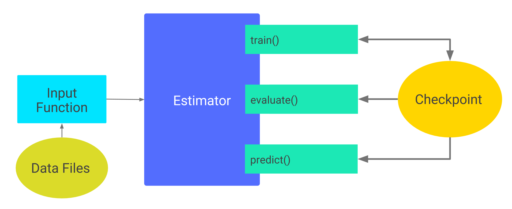

#Tensorflow

##[机器学习术语表][3]


[Tensorflow入门链接][1]

[Tensorflow models链接][2]


Estimator
==
### 创建一个或多个输入函数
```
创建输入函数来提供用于训练、评估和预测的数据
    输入函数是返回 tf.data.Dataset 对象的函数（可以以任何方式生成建议使用 TensorFlow 的 Dataset API，它可以解析各种数据）
    格式：features,label
        features - Python 字典，其中：
            每个键都是特征的名称。
            每个值都是包含此特征所有值的数组。
        label - 包含每个样本的标签值的数组。
```
#### 简单的实现
```
def input_evaluation_set():
    features = {'SepalLength': np.array([6.4, 5.0]),
                'SepalWidth':  np.array([2.8, 2.3]),
                'PetalLength': np.array([5.6, 3.3]),
                'PetalWidth':  np.array([2.2, 1.0])}
    labels = np.array([2, 1])
    return features, labels
```

### 定义模型的特征列
```
特征列是一个对象，用于说明模型应该如何使用特征字典中的原始输入数据。在构建 Estimator 模型时，您会向其传递一个特征列
的列表，其中包含您希望模型使用的每个特征。tf.feature_column 模块提供很多用于向模型表示数据的选项。
```

```
# Feature columns describe how to use the input.
my_feature_columns = []
for key in train_x.keys():
    my_feature_columns.append(tf.feature_column.numeric_column(key=key))
```
### 实例化 Estimator，指定特征列和各种超参数

>TensorFlow 提供了几个预创建的分类器 Estimator

> - tf.estimator.DNNClassifier：适用于执行多类别分类的深度模型。

> - tf.estimator.DNNLinearCombinedClassifier：适用于宽度和深度模型。

> - tf.estimator.LinearClassifier：适用于基于线性模型的分类器。

### 训练、评估和预测

- 训练模型。
- 评估经过训练的模型。
- 使用经过训练的模型进行预测。

如何保存和恢复通过 Estimator 构建的 TensorFlow 模型
=============
- 检查点：这种格式依赖于创建模型的代码。

- [SavedModel][4]：这种格式与创建模型的代码无关。

## 保存经过部分训练的模型
### Estimator 自动将以下内容写入磁盘：

- 检查点：训练期间所创建的模型版本。
- 事件文件：其中包含 TensorBoard 用于创建可视化图表的信息

```
要指定 Estimator 在其中存储其信息的顶级目录，请为任何 Estimator 的构造函数的可选 model_dir 参数分配一个值
classifier = tf.estimator.DNNClassifier(
    feature_columns=my_feature_columns,
    hidden_units=[10, 10],
    n_classes=3,
    model_dir='models/path')
```

#### 默认检查点目录


>如果您未在 Estimator 的构造函数中指定 model_dir，则 Estimator 会将检查点文件写入由 Python 的 tempfile.mkdtemp 函数选择的临时目录
中


#### 检查点频率

>默认情况下，Estimator 按照以下时间安排将检查点保存到 model_dir 中：

- 每 10 分钟（600 秒）写入一个检查点。
- 在 train 方法开始（第一次迭代）和完成（最后一次迭代）时写入一个检查点。
- 只在目录中保留 5 个最近写入的检查点。

>可以通过执行下列步骤来更改默认时间

- 创建一个 RunConfig 对象来定义所需的时间安排。
- 在实例化 Estimator 时，将该 RunConfig 对象传递给 Estimator 的 config 参数。

```
my_checkpointing_config = tf.estimator.RunConfig(
    save_checkpoints_secs = 20*60,  # Save checkpoints every 20 minutes.
    keep_checkpoint_max = 10,       # Retain the 10 most recent checkpoints.
)

classifier = tf.estimator.DNNClassifier(
    feature_columns=my_feature_columns,
    hidden_units=[10, 10],
    n_classes=3,
    model_dir='models/path',
    config=my_checkpointing_config)
```

### 恢复模型

第一次调用 Estimator 的 train 方法时，TensorFlow 会将一个检查点保存到 model_dir 中。随后每次调用 Estimator 的 train、eval 或 predict 方法时，都会发生下列情况：

- Estimator 通过运行 model_fn() 构建模型图。(要详细了解 model_fn()，请参阅创建自定义 Estimator)
- Estimator 根据最近写入的检查点中存储的数据来初始化新模型的权重。

一旦存在检查点，TensorFlow 就会在您每次调用 train()、evaluate() 或 predict() 时重建模型。



### 避免不当恢复

通过检查点恢复模型的状态这一操作仅在模型和检查点兼容时可行(当模型重要参数发生变化时，无法检查点恢复)


[1]:https://www.tensorflow.org/get_started/premade_estimators?hl=zh-cn "Tensorflow入门链接"
[2]:https://github.com/tensorflow/models "Tensorflow models链接"
[3]:https://developers.google.com/machine-learning/glossary/?hl=zh-cn#TensorBoard "机器学习术语表"
[4]:https://www.tensorflow.org/programmers_guide/saved_model?hl=zh-cn "《TensorFlow 编程人员指南》- 保存和恢复"
