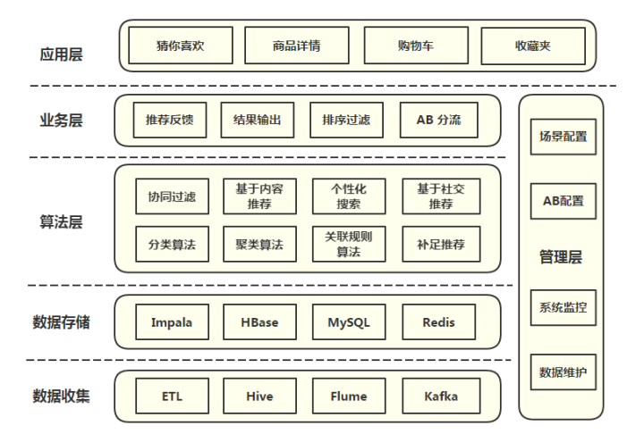

# 推荐算法



## 原理

尽可能多的收集用户信息及行为，基于相似性的基础提供推荐

## 分类

- 根据是否为不同用户推荐不同商品
    - 基于大众行为（网站管理员自行推荐，或者基于系统所有用户的反馈统计计算出的当下比较流行的物品）
    - 个性化推荐引擎（帮你找志同道合，趣味相投的朋友，然后在此基础上实行推荐）
- 根据其数据源
    - 基于人口统计学的（用户年龄或性别相同判定为相似用户）
    - 基于内容的（物品具有相同关键词和Tag，没有考虑人为因素）
    - 基于协同过滤（根据用户对物品或者信息的偏好，发现物品或者内容本身的相关性，或者是发现用户的相关性，然后再基于这些关联性进行推荐。）
        - 基于用户的推荐(通过共同口味与偏好找相似邻居用户，K-邻居算法，你朋友喜欢，你也可能喜欢)
        - 基于项目的推荐(发现物品之间的相似度，推荐类似的物品，你喜欢物品A，C与A相似，可能也喜欢C)
        - 基于模型的推荐(基于样本的用户喜好信息构造一个推荐模型，然后根据实时的用户喜好信息预测推荐)
- 根据其建立方式
    - 基于用户和物品本身（用户-物品二维矩阵描述用户喜好，聚类算法）
    - 基于关联规则的（The Apriori algorithm算法是一种最有影响的挖掘布尔关联规则频繁项集的算法）
    - 基于模型的推荐（机器学习，所谓机器学习，即让计算机像人脑一样持续学习，是人工智能领域内的一个子领域）

```
不过一般实践中，我们通常还是把推荐引擎分两类：
第一类称为协同过滤，即基于相似用户的协同过滤推荐（用户与系统或互联网交互留下的一切信息、蛛丝马迹，或用户与用户之间千丝万缕的联系），以及基于相似项目的协同过滤推荐（尽最大可能发现物品间的相似度）；
第二类便是基于内容分析的推荐（调查问卷，电子邮件，或者推荐引擎对本blog内容的分析）。
```

## 具体算法

#### 协同过滤推荐

协同过滤是利用集体智慧的一个典型方法。要理解什么是协同过滤 (Collaborative Filtering, 简称 CF)，首先想一个简单的问题，如果你现在想看个电影，但你不知道具体看哪部，你会怎么做？大部分的人会问问周围的朋友或者称之为广义上的邻居(neighborhood)，看看最近有什么好看的电影推荐，而我们一般更倾向于从口味比较类似的朋友那里得到推荐。这就是协同过滤的核心思想。

- 协同过滤推荐步骤
    1. 若要做协同过滤，那么收集用户偏好则成了关键。可以通过用户的行为诸如评分（如不同的用户对不同的作品有不同的评分，而评分接近则意味着喜好口味相近，便可判定为相似用户），投票，转发，保存，书签，标记，评论，点击流，页面停留时间，是否购买等获得。如下面第2点所述：所有这些信息都可以数字化，如一个二维矩阵表示出来。
    2. 收集了用户行为数据之后，我们接下来便要对数据进行减噪与归一化操作(得到一个用户偏好的二维矩阵，一维是用户列表，另一维是物品列表，值是用户对物品的偏好，一般是 [0,1] 或者 [-1, 1] 的浮点数值)。下面再简单介绍下减噪和归一化操作：
        - 所谓减噪：用户行为数据是用户在使用应用过程中产生的，它可能存在大量的噪音和用户的误操作，我们可以通过经典的数据挖掘算法过滤掉行为数据中的噪音，这样可以是我们的分析更加精确（类似于网页的去噪处理）。
        - 所谓归一化：将各个行为的数据统一在一个相同的取值范围中，从而使得加权求和得到的总体喜好更加精确。最简单的归一化处理，便是将各类数据除以此类中的最大值，以保证归一化后的数据取值在 [0,1] 范围中。至于所谓的加权，很好理解，因为每个人占的权值不同，类似于一场唱歌比赛中对某几个选手进行投票决定其是否晋级，观众的投票抵1分，专家评委的投票抵5分，最后得分最多的选手直接晋级。
    3. 找到相似的用户和物品，通过什么途径找到呢？便是计算相似用户或相似物品的相似度。
    4. 相似度的计算有多种方法，不过都是基于向量Vector的，其实也就是计算两个向量的距离，距离越近相似度越大。在推荐中，用户-物品偏好的二维矩阵下，我们将某个或某几个用户对莫两个物品的偏好作为一个向量来计算两个物品之间的相似度，或者将两个用户对某个或某几个物品的偏好作为一个向量来计算两个用户之间的相似度。
        - 相似度计算算法可以用于计算用户或者项目相似度。以项目相似度计算（Item Similarity Computation）为列，通性在于都是从评分矩阵中，为两个项目i，j挑选出共同的评分用户，然对这个共同用户的评分向量，进行计算相似度si,j
        - 找物品间的相似度，用户不变，找多个用户对物品的评分；找用户间的相似度，物品不变，找用户对某些个物品的评分。
    5. 计算出来的这两个相似度则将作为基于用户、项目的两项协同过滤的推荐。
        - 常见的计算相似度的方法有：欧几里德距离，皮尔逊相关系数（如两个用户对多个电影的评分，采取皮尔逊相关系数等相关计算方法，可以抉择出他们的口味和偏好是否一致），Cosine相似度，Tanimoto系数。
    6. 相似邻居计算。邻居分为两类：1、固定数量的邻居K-neighborhoods （或Fix-size neighborhoods），不论邻居的“远近”，只取最近的 K 个，作为其邻居，如下图A部分所示；2、基于相似度门槛的邻居，落在以当前点为中心，距离为 K 的区域中的所有点都作为当前点的邻居。
    7. 经过 iv 计算出来的基于用户的CF(基于用户推荐之用：通过共同口味与偏好找相似邻居用户，K-邻居算法，你朋友喜欢，你也可能喜欢)，基于物品的CF(基于项目推荐之用：发现物品之间的相似度，推荐类似的物品，你喜欢物品A，C与A相似，那么你可能也喜欢C)。

- 特点

    - 优点
        - 需要最小域
        - 不需要用户和项
        - 大部分场景中能够产生足够好的结果
    - 缺点
        - 冷启动问题
        - 需要标准化产品
        - 需要很高的用户和项的比例（1：10）
        - 流行度偏见（有长尾的时候表现不够好）
        - 难于提供解释
        
#### 基于内容推荐
- 聚类（聚类，通俗的讲，即所谓“物以类聚，人以群分”。聚类 (Clustering) 是一个数据挖掘的经典问题，它的目的是将数据分为多个簇 (Cluster)，在同一个簇中的对象之间有较高的相似度，而不同簇的对象差别较大。）
    - K 均值聚类算法
    - Canopy 聚类算法 
        -  Canopy 聚类算法的基本原则是：首先应用成本低的近似的距离计算方法高效的将数据分为多个组，这里称为一个 Canopy，我们姑且将它翻译为“华盖”，Canopy 之间可以有重叠的部分；然后采用严格的距离计算方式准确的计算在同一 Canopy 中的点，将他们分配与最合适的簇中。Canopy 聚类算法经常用于 K 均值聚类算法的预处理，用来找合适的 k 值和簇中心。
    - 模糊 K 均值聚类算法 
        -  K 均值聚类的扩展，它的基本原理和 K 均值一样，只是它的聚类结果允许存在对象属于多个簇，也就是说：它属于我们前面介绍过的可重叠聚类算法    
-  分类
    - 决策树学习
    - 贝叶斯分类

- 特点
    - 优点
        - 没有冷启动问题
        - 不需要惯用数据
        - 没有流行度偏见，可以推荐有罕见特性的项
        - 可以使用用户内容特性来提供解释
    - 缺点
        - 项内容必须是机器可读的和有意义的
        - 容易归档用户
        - 很难有意外，缺少多样性
        - 很难联合多个项的特性

#### 多种推荐方式结合
综合利用协同过滤推荐算法和基于内容的推荐算法各自的优点同时抵消各自的缺点，多种推荐方式结合，加权（用线性公式（linear formula）将几种不同的推荐按照一定权重组合起来，具体权重的值需要在测试数据集上反复实验，从而达到最好的推荐效果。）、切换、分区、分层等混合。但不论是哪种推荐方式，一般也就涵盖在上文所述的推荐方式中。
- 类型
    - 加权
    - 交换
    - 混合
    - 特性组合
    - 案列
    - 特征增强
    - 元层次
    
- 特点
    - 优点
        - 由于单独使用协同过滤推荐算法和基于内容的推荐算法
        - 没有冷启动问题
        - 没有流行度偏见，可推荐有罕见特性的项
        - 可产生意外，实现多样性
    - 缺点
        - 需要通过大量的工作才能得到正确的平衡

#### 流行度推荐算法

一种推荐流行项的方法(例如最多下载、最多看过、最大影响的项)，使用惯用数据和项的内容（例如类目）

- 特点
    - 优点
        - 相对容易实现
        - 良好的基准算法
        - 有助于解决新用户冷启动问题
    - 缺点
        - 需要标准化产品
        - 经常需要一些项的类型进行分类
        - 不会推荐新项（很少有机会被观测到）
        - 推荐列表不会改变太大
        
#### 高级非传统推荐算法

- 类型
    - 深度学习
    - 学习等级
    - Multi-armed bandits（探索/开发）
    - 上下文感知推荐
    - 张量分解
    - 分解机
    - 社会推荐

- 特点
    - 优点
        - 利于勉强维持最终性能百分点
        - 你可以说你正在使用渐进的方式
    - 缺点
        - 难于理解
        - 缺乏推荐工具支持
        - 没有为你的首个推荐系统提供推荐的方式


