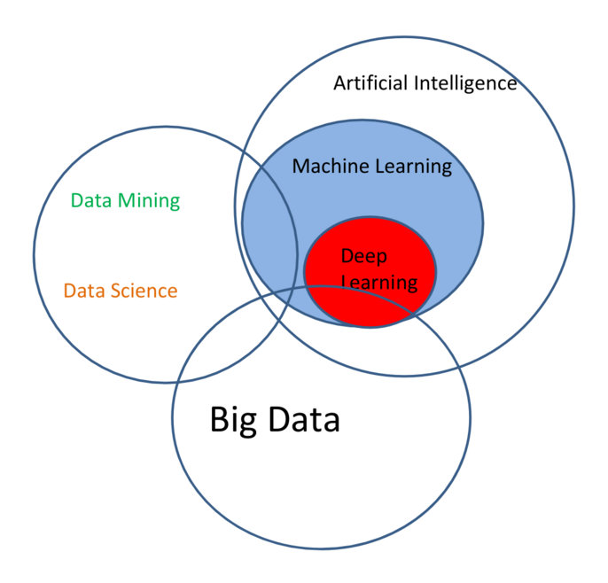
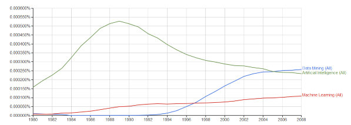

[数据科学](http://innovaleur.com/the-data-science-puzzle-explained/)

网络上没有任何关于数据科学术语之间对比的文章，各个类型的文章被各种各样的人写给那些聆听者，这种趋势几乎是压倒性的。

所以，让我直截了当地为那些想知道这些的人写一篇这样的帖子。

我认为，虽然可能有很多关于意见部分的定义和相关术语之间的比较。事实上，很多术语是并不是一成不变的并且被大多数人承认的，坦率的说，与其他人的观点的碰撞是完善丰富自己想法的最好途径。

因此，当一个人并不完全（甚至微乎其微）同意我关于术语的很多看法，可能还有一些东西是在这些之外的。我将研究数据科学的几个核心概念。或者，至少，我认为是核心。我会尽力提出它们之间的关系以及它们如何作为一个更大拼图的单个部分组合在一起。

作为一些有些不同意见的例子，在单独考虑任何概念之前，KDnuggets的Gregory Piatetsky-Shapiro汇总了以下维恩图，其中概述了我们将在此考虑的相同数据科学术语之间的关系。我们鼓励读者将这个维恩图与Drew Conway的数据科学维恩图进行比较，
以及下面我自己的讨论以及帖子底部附近的修改过程/关系图。我认为，虽然存在差异，但是这些概念与某种程度的相似性排列在一起（参见前几段）。

我们现在将对上述维恩图中描述的相同的6个核心概念进行讲解，并提供一些有关如何将它们组合到数据科学难题中的见解。
首先，我们很快就能讲解过去十年中最热门的话题之一。

### Big Data

有很多文章有关于大数据的定义，我不会在这些概念上讲太多东西，我只想说大数据通常可以定义为大小的数据集>>超出了常用软件工具获取，管理和处理的能力。>>大数据是一个不断变化的目标;这个定义既模糊又准确，足以抓住其核心特征。

至于我们将要研究的其余概念，最好先了解一下他们的搜索术语流行度和N-gram频率，以帮助将事实与炒作区分开来。鉴于这些概念中的一对相对较新，我们从1980年到2008年的“老”概念的N-gram频率如上所示。

最近的谷歌趋势显示了2个新术语的上升，有2个持续趋势上升，以及最后一个逐渐但明显的下降。请注意，由于已经对数据进行了定量分析，因此大数据未包含在上述图形中。请继续阅读以进一步了解观察结果。

### Machine Learning

根据Tom Mitchell在他关于这个主题的开创性著作中的说法，机器学习就是这样<<关注如何构建自动改进经验的计算机程序的问题。<<机器学习本质上是跨学科的，并且采用来自计算机科学，统计学和人工智能等领域的技术，等等。机器学习研究的主要工作是可以从经验中自动改进的算法，可以应用于各种不同领域的算法。

我认为没有人怀疑机器学习是数据科学的核心方面。我在下面给出了数据科学详细处理这个术语，但是如果你认为它处于一个非常高的水平，它的目标是从数据中提取洞察力，机器学习是允许该过程自动化的引擎。机器学习与经典统计有很多共同之处，因为它使用样本来推断和推广。

