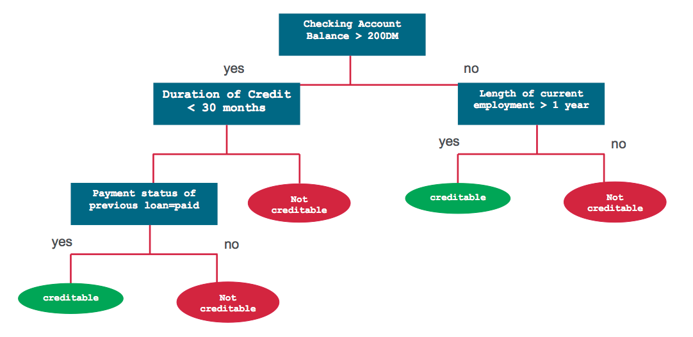

[从决策树到随机森林](https://www.jiqizhixin.com/articles/2017-07-31-3)

树型算法的原理与实现
==

常见的树模型：

- 决策树
- 随机森林
- 提升树

决策树
--

1. 监督学习算法
2. 适用于类别和连续输入特征和输出预测变量

分类和回归树（简称 CART）用来解决分类或回归预测建模问题的决策树算法

常使用 scikit 生成并实现决策树： 

- sklearn.tree.DecisionTreeClassifier 分类树
- sklearn.tree.DecisionTreeRegressor 回归树

### CART 模型

- 包括选择输入变量和那些变量上的分割点，直到创建出适当的树
- 使用贪婪算法（greedy algorithm）选择使用哪个输入变量和分割点，以使成本函数（cost function）最小化
- 预定义停止准则，比如分配到树上每一个叶结点的训练样本达到最小数量

其他决策树算法

- ID3：Iterative Dichotomiser 3
- C4.5：ID3 算法的改进
- CHAID：Chi-squared Automatic Interaction Detector
- MARS：决策树的扩展式，以更好地解决数值型预测。
- 条件推断树

### 回归树
